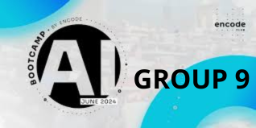

# WP_03_EC_AI_24Q2-Painting Description Application

Weekend Project 03 - Encode Club AI BootCamp 24Q2 Repository

## Project Overview

This project involves creating an application from scratch using Next.js and integrating OpenAI's API to develop an assistant that composes detailed descriptions of paintings based on user input. The application allows users to select a painting theme, generate a detailed description, and then request an image to be generated based on the description.

## Features

- **Painting Description Assistant**: Uses OpenAI to generate detailed descriptions of paintings.
- **Theme Selection**: Users can pick a theme for the painting.
- **Generate Description**: Button to send a message to the assistant and generate a painting description.
- **Image Generation**: Request and display images based on the generated descriptions.
- **Loader**: Displays a loader while the image is being generated.
- **Form for Image Parameters**: Users can choose parameters for image generation.

## Example video

## Project Members Group 9

- [Emmanuel](https://github.com/codehouze)
- [Alessio](https://github.com/AlessioChen)
- [Jan-Christoph](https://github.com/jcklie)
- [Akash](https://github.com/kshntn)
- [Serena](https://github.com/BreadFeet)
- [Raymond](https://github.com/90barricade93/)

## Installation

#

## Conclusion

This project demonstrates the integration of Next.js with OpenAI's API to create an interactive assistant capable of generating detailed painting descriptions and corresponding images. The application showcases the potential of AI in creative fields and provides users with a dynamic tool for exploring painting themes and descriptions.

Feel free to contribute, suggest improvements, or ask questions. Happy coding!

### Acknowledgements

We would like to thank the [Encode Club AI BootCamp](https://github.com/Encode-Club-AI-Bootcamp) for this opportunity and [@mpagani](https://github.com/MatheusDaros) for his guidance.

 &ensp; © GROUP 9 - AI 24Q2 &ensp; 

---
